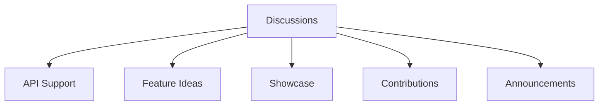
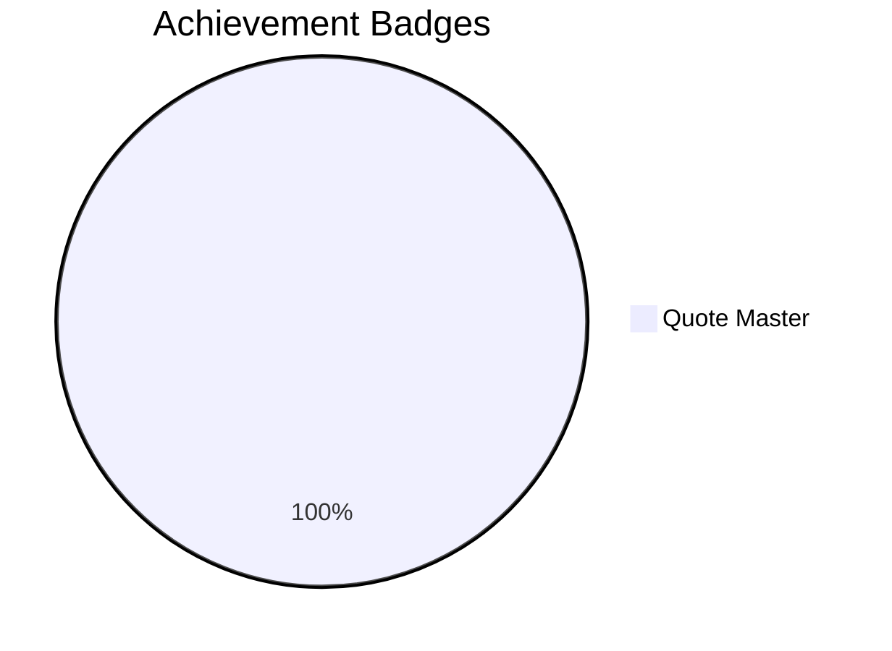
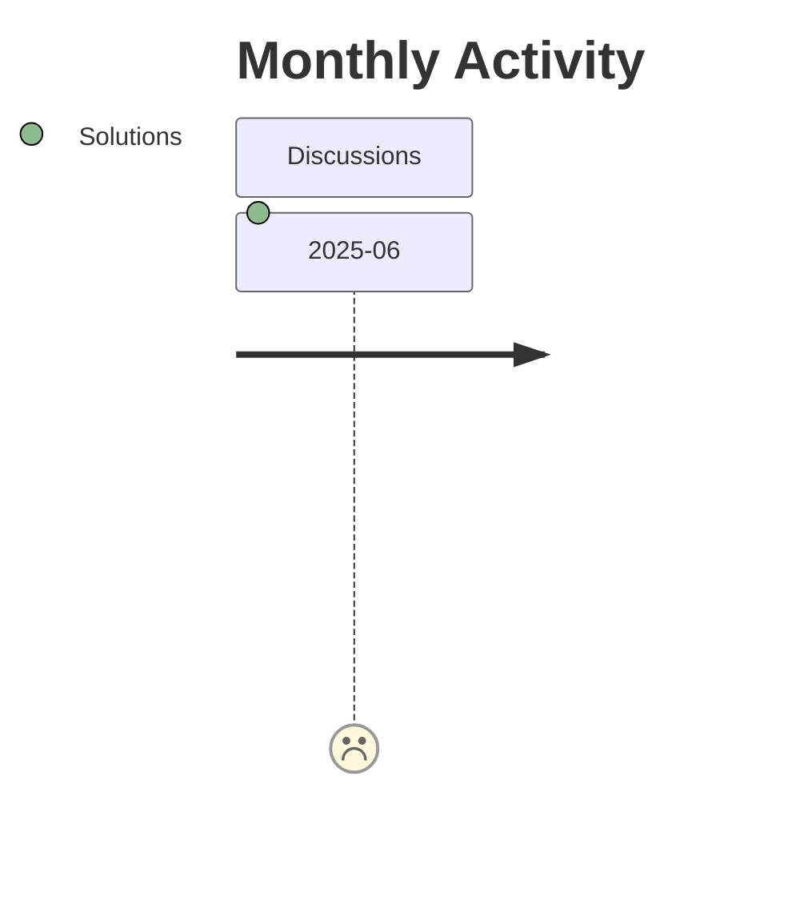

# AniQuotes Discussions Hub

## Welcome to the AniQuotes Community Forum!

This is the central hub for developers, anime fans, and contributors to discuss everything related to the AniQuotes API ecosystem. Share ideas, get support, and collaborate with fellow weeb developers!



## Discussion Categories

### 1. 🛠️ API Support & Troubleshooting
Get help with API integration, report bugs, and troubleshoot issues  
**Example Topics:**
- "Getting 429 rate limit errors - best practices?"
- "Image generation not working with JP characters"
- "CORS issues with React implementation"

### 2. 💡 Feature Requests & Ideas
Suggest and vote on new features for the API  
**Popular Requests:**
- [VOTE] Add character voice clips to quotes
- [VOTE] Implement user favorites system
- New image style: Cyberpunk Edgerunners theme

### 3. 🎨 Project Showcase
Share what you've built with our API  
**Recent Showcases:**
- Discord bot that posts daily quotes
- Anime quote Chrome new tab extension
- Flutter app with quote collections

### 4. 🌐 Contribution Central
Coordinate on translations and content additions  
**Current Initiatives:**
- Spanish translation project (75% complete)
- One Piece quote marathon (adding 100+ quotes)
- Improving quote accuracy verification

### 5. 📢 Announcements & Updates
Official news from the core team  
**Latest Updates:**
- v1.3.0 Release Notes - New endpoints!
- Server maintenance schedule
- Hackathon partnership announcement

## Discussion Guidelines

```markdown
1. **Be Respectful** - We're all fans here!
2. **Use Categories** - Keep discussions organized
3. **Search First** - Avoid duplicate topics
4. **Provide Details** when asking for help:
   - API endpoint used
   - Language/stack
   - Error messages
   - Code snippets (use code blocks!)
5. **Upvote** good answers
6. **Mark Solutions** when your question is answered
```

## How to Create a Great Discussion

### Feature Request Template
```markdown
## Feature Name
**What problem does this solve?**  
[Description of the issue or opportunity]

**Describe the solution**  
[Clear explanation of your proposed feature]

**Alternative solutions**  
[Any other approaches you considered]

**Additional context**  
[Screenshots, mockups, or API examples]
```

### 👮 Support Request Template
````markdown
## [Brief Description of Issue]

**API Endpoint:**  
`GET /v2/image?id=123`

**Language/Framework:**  
Node.js v18 / Express

**Error Message:**  
```json
{
  "error": "Image generation failed",
  "credit": "GitHub/Shineii86"
}
```

**Steps to Reproduce:**
1. Call endpoint with valid ID
2. ... 
3. Error occurs

**Code Snippet:**
```javascript
const response = await fetch(`https://api.aniquotes.org/v2/image?id=123`);
// Error handling code here
```

**Screenshots:**  
[If applicable]
````

## Community Resources

| Resource | Description | Access |
|----------|-------------|--------|
| **API Docs** | Complete endpoint documentation | [View Docs](https://github.com/AniQuotes/Documentation) |

## Badge System

Earn recognition for community participation:



**How to Earn:**
- 🏆 10+ helpful answers = API Sensei
- 🌍 3 translation contributions = Polyglot Contributor
- 💡 Top-voted feature request = Idea Catalyst

## Community Moderation

**Our Team:**
- [Shinei Nouzen](https://github.com/Shineii86) (Lead Maintainer)

**Please Report:**
- Spam/commercial posts
- Inappropriate content
- Harassment or discrimination
- Security vulnerabilities (via private report)

## Discussion Stats



**Top Contributors This Month:**

> *Join the conversation and help shape the future of AniQuotes API! Your voice matters in our community!*

---

<div align="center">
  
**AniQuotes** For inquiries or collaborations
     
[](https://telegram.me/Shineii86 "Contact on Telegram")
[](https://instagram.com/ikx7.a "Follow on Instagram")
[](https://pinterest.com/ikx7a "Follow on Pinterest")
[](mailto:ikx7a@hotmail.com "Send an Email")

<sup>Maintained by [Shinei Nouzen](https://github.com/Shineii86) © 2025 AniQuotes - All Rights Reserved</sup>

</div>
